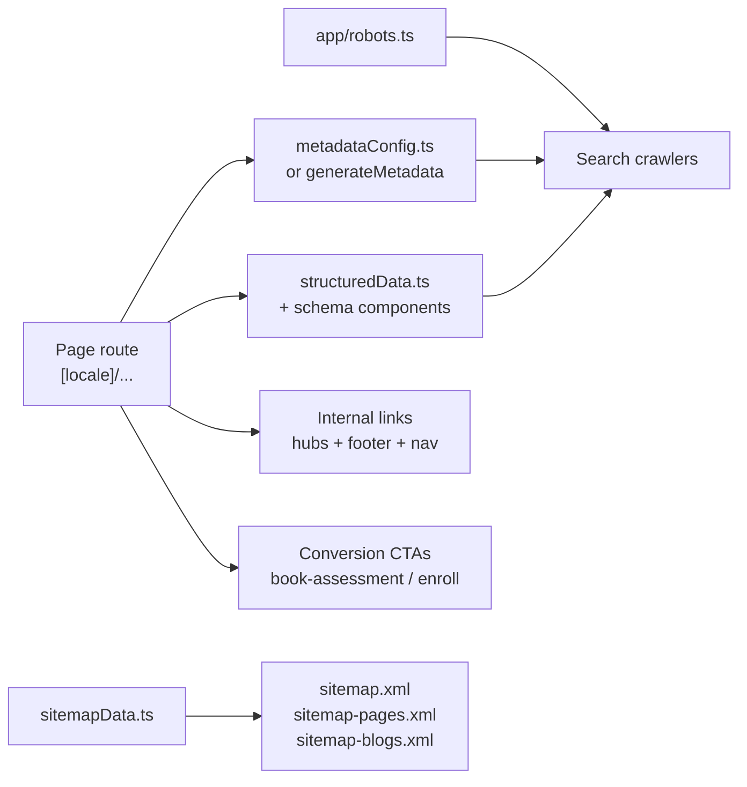

# GrowWise School — SEO Architecture Hub

This document maps how SEO is implemented in `growwise_newui` and links to operational runbooks.

**Implementation rules (mandatory before route/content changes):** [`.cursor/SEO.md`](../.cursor/SEO.md) — strategy, validation gates, merge criteria, and do-not-do list.

---

## Architecture overview



**Primary business goal:** increase booked assessments (`/book-assessment`) and paid enrollments (`/enroll`).

---

## File reference

| Concern | Location |
|---------|----------|
| Page titles, descriptions, keywords | `src/lib/seo/metadataConfig.ts`, `src/lib/seo/metadata.ts` |
| Canonical site URL | `src/lib/seo/siteUrl.ts` → `getCanonicalSiteUrl()` |
| Sitemap entries + XML helpers | `src/lib/seo/sitemapData.ts` |
| Sitemap route handlers | `src/app/sitemap-index.xml/route.ts`, `sitemap-pages.xml/`, `sitemap-blogs.xml/` (+ rewrite in `next.config.ts`) |
| Crawl policy | `src/app/robots.ts` (no `public/robots.txt`) |
| Legacy path redirects | `src/lib/seo/legacy-path-redirects.ts`, `next.config.ts` |
| JSON-LD helpers | `src/lib/seo/structuredData.ts` |
| Schema components | `src/components/schema/` |
| Camp SEO landing pages | `src/lib/camps/get-camp-page.ts`, `src/lib/seo/camp-metadata.ts` |
| Featured camp guide tiles | `src/components/camps/FeaturedCampGuidesSection.tsx` |
| Blog conversion bands | `src/components/blogs/BlogPostConversionSection.tsx` |
| Resource article registry | `src/data/resources/index.ts` → `RESOURCE_ARTICLE_PATHS` |
| Locale routing | `src/middleware.ts` (`localePrefix: 'never'`) |
| Locale-aware paths | `src/lib/publicPath.ts` → `publicPath()`, `absoluteSiteUrl()` |
| AEO hints | `src/app/llms.txt` |
| OG image route | `src/app/og-image.jpg` |

---

## Sitemap structure

| Sitemap | Contents |
|---------|----------|
| `/sitemap.xml` | Index (`<sitemapindex>`) pointing to child sitemaps |
| `/sitemap-pages.xml` | Core pages, academic, courses, Future Skills, camps, enroll, assessment |
| `/sitemap-blogs.xml` | `/growwise-blogs/*` posts + `/resources/*` articles |

**Adding a new indexable page:** edit `sitemapData.ts` (`corePages`, `blogPostPaths`, or rely on `RESOURCE_ARTICLE_PATHS` / `getCampSlugs()`).

---

## Hub-and-spoke content map

Cross-link these clusters; do not delete or redirect URLs without GSC validation (see `.cursor/SEO.md` §7, §18).

| Priority | Hub | Spokes / related URLs |
|----------|-----|----------------------|
| **Primary** | **Academic** | `/academic`, `/academic/math`, `/academic/english`, `/courses/sat-prep`, `/math-finals-practice-session` |
| **Primary** | **Future Skills / certifications** | `/future-skills`, `/future-skills/design-creative-media`, `/future-skills/python-certification`, `/future-skills/ai-machine-learning`, `/future-skills/ai-entrepreneurship` |
| **Primary** | **Parent content** | `/readinesschecklist`, `/resources`, `/resources/*` articles |
| **Secondary** | **Summer camps** | `/camps/summer`, `/camps/academic-summer-programs-dublin-ca`, `/camps/{slug}` camp guides |
| **Secondary** | **Local** | `/dublin-ca`, location mentions on academic/camp pages |
| **Secondary** | **Assessment funnel** | `/book-assessment`, `/self-check`, `/enroll`, `/enroll-academic` |
| **Live, non-priority** | **Game dev / legacy STEAM** | `/steam/game-development`, `/game-dev`, `/coding` — keep indexable and cross-linked; do not promote in nav or new SEO work unless requested |

---

## Developer checklists

Use these when implementing new pages. Strategy and merge gates: `.cursor/SEO.md`.

### New marketing page (`src/app/[locale]/`)

- [ ] Page lives under `src/app/[locale]/{path}/page.tsx` only. Never duplicate at root `app/{path}/page.tsx` — that shadows the locale route (see `/enroll` lesson).
- [ ] **Metadata:** Add entry to `metadataConfig.ts` **or** page-level `generateMetadata` using `getCanonicalSiteUrl()` + `absoluteSiteUrl()` from `@/lib/publicPath`.
- [ ] **Title / description:** Title ≤ 60 characters. Description ≤ 150 characters. No pricing in meta descriptions.
- [ ] **Headings:** One `h1` matching page intent. Logical `h2` → `h3` hierarchy.
- [ ] **Sitemap:** If indexable, add to `sitemapData.ts` (`corePages`, camp slugs via `getCampSlugs()`, or the appropriate array).
- [ ] **JSON-LD:** Reuse helpers in `structuredData.ts` and `src/components/schema/`. FAQ visible text must match FAQPage JSON-LD exactly.
- [ ] **Internal links:** Page is linked **from** at least one hub (nav, footer, programs, camps, academic, or a related parent page). No orphan indexable URLs.
- [ ] **Conversion:** Primary CTA visible without excessive scroll on mobile. Use `publicPath(path, locale)` — never hardcode `/en/...`.
- [ ] **Images:** `next/image` with `alt`, `sizes`, and appropriate `priority`/`loading`.

### New blog post (`/growwise-blogs/*`)

- [ ] Create `src/app/[locale]/growwise-blogs/{slug}/page.tsx`
- [ ] Add slug path to `blogPostPaths` in `sitemapData.ts`
- [ ] `generateMetadata`: title, description, canonical, OG image
- [ ] Article JSON-LD via `generateArticleSchema()` in `structuredData.ts`
- [ ] Bottom CTA: use `BlogPostConversionSection` — **never** enroll-only bottom bands

#### Program mapping by article intent

Prefer certification and academic hubs. Game dev mapping is secondary only.

| Intent | `programHref` | `programLabel` |
|--------|---------------|----------------|
| Coding / Python / Java / AI / career / certification | `/future-skills` | Explore Certification Pathways |
| Academic / learning gaps / focus / math / English | `/academic` | Explore Academic Programs |
| Summer camps | `/camps/summer` | View Summer Camp Programs |
| Assessment-led | `/book-assessment` | Book Free Assessment |
| Math self-check | `/self-check` | Take the Math Self-Check |
| Game dev / Roblox *(secondary — use only when article is explicitly about game dev)* | `/steam/game-development` | Explore Game Development |

```tsx
import { BlogPostConversionSection } from '@/components/blogs/BlogPostConversionSection';

<BlogPostConversionSection
  locale={locale}
  programHref="/future-skills"
  programLabel="Explore Certification Pathways"
/>
```

Every blog conversion band includes: **program CTA** + **Book Free Assessment** + **Or enroll now** (tertiary link).

### New resource article (`/resources/*`)

- [ ] Add path to `RESOURCE_ARTICLE_PATHS` in `src/data/resources/index.ts` — sitemap picks it up automatically
- [ ] Follow existing resource page pattern (structured sections, FAQ, related links)
- [ ] Link from `/resources` hub and footer when published
- [ ] Metadata + Article/FAQ JSON-LD matching visible content

### New camp SEO page (`/camps/{slug}`)

- [ ] Camp data in `src/lib/camps/` (see `get-camp-page.ts`, `CAMP_LANDING_PAGES`)
- [ ] Slug included via `getCampSlugs()` in sitemap
- [ ] Linked from `/camps/summer` (`FeaturedCampGuidesSection`) and/or camps hub
- [ ] Camp-specific metadata via `src/lib/seo/camp-metadata.ts` where applicable

### `/enroll` routing (do not regress)

- `/enroll` → marketing enrollment form (locale layout with header/footer)
- `/enroll?program=...` → Phase3 payment stepper (`EnrollPhase3Page`)
- Phase3 steps live under `src/app/enroll/steps/`; page component at `src/components/enroll/EnrollPhase3Page.tsx`

---

## Content systems

### Resources (`/resources/*`)

- Registry: `RESOURCE_ARTICLE_PATHS` in `src/data/resources/index.ts`
- Modern structured pages with FAQ, related content, and hub links
- Auto-included in blogs sitemap when path is in registry
- Hub at `/resources` only — not duplicated in pages sitemap

### Legacy blogs (`/growwise-blogs/*`)

- Individual `page.tsx` per slug under `src/app/[locale]/growwise-blogs/`
- Slugs listed manually in `sitemapData.ts` → `blogPostPaths`
- Bottom CTA standard: `BlogPostConversionSection` (program + assessment + enroll)

### Two content systems (do not conflate)

| System | Path | Standards |
|--------|------|-----------|
| **Resources** | `/resources/*` | Modern hub-and-spoke; structured metadata; footer/nav links |
| **Legacy blogs** | `/growwise-blogs/*` | Must still meet metadata, sitemap, and `BlogPostConversionSection` standards |

Parallel program URLs (`/coding`, `/game-dev` vs `/steam/*`) both remain indexable — cross-link between them; do not delete without GSC gate.

---

## Conversion path patterns

### Blog posts

```
Article content → relevant program hub → /book-assessment → /enroll (tertiary)
```

Component: `src/components/blogs/BlogPostConversionSection.tsx`

### Camp pages

```
/camps/summer hub → FeaturedCampGuidesSection → /camps/{slug} → request seat / assessment
```

Component: `src/components/camps/FeaturedCampGuidesSection.tsx`

### Programs hub

```
/programs → Book Free Assessment (primary) + Enroll Now + academic / Future Skills cards
```

---

## Known gotchas

| Issue | Resolution |
|-------|------------|
| `/enroll` route shadowing | Marketing form at `[locale]/enroll`; Phase3 only when `?program=` is set. No root `app/enroll/page.tsx`. |
| Readiness URL duplicate | Canonical is `/readinesschecklist`. `/resources/readiness-checklist` still exists — resolve per `.cursor/SEO.md` §7. |
| Locale robots + redirects | Do **not** `Disallow` `/en/`, `/hi/`, `/zh/`, `/es/` in `robots.ts` — Googlebot must crawl prefixed URLs to process middleware redirects (`.cursor/SEO.md` §5). |
| `/en/` legacy URLs | Middleware 301s to prefix-free canonical. Do not make `/en/*` return 200. |
| Sitemap index | `/sitemap.xml` is a rewrite to `/sitemap-index.xml` — do not add conflicting `app/sitemap.xml/route.ts`. |
| Parallel STEAM URLs | `/coding` and `/game-dev` coexist with `/steam/*` — cross-link; non-priority for new SEO work. |
| Robots conflict | Only `app/robots.ts`. Never reintroduce `public/robots.txt`. |
| FAQ JSON-LD | Visible FAQ text must match `FAQPage` schema exactly (AEO + Rich Results). |
| Email addresses | Frontend uses `contact@growwiseschool.org`; backend notification constants may differ — don't mix in user-facing copy without checking. |

---

## Automated tests

| Test file | What it guards |
|-----------|----------------|
| `src/lib/seo/__tests__/robots.seo.test.ts` | Merged robots disallow rules |
| `src/lib/seo/__tests__/sitemapData.test.ts` | Sitemap paths and XML output |
| `src/lib/seo/__tests__/metadata-length-limits.test.ts` | Title/description length |
| `src/lib/seo/__tests__/seo-jsonld-route-audit.test.ts` | JSON-LD on key routes |
| `src/lib/seo/__tests__/countJsonLdTypes.test.ts` | Duplicate schema types |
| `src/lib/seo/__tests__/homeFaqSchemaDuplicate.test.ts` | Single FAQPage on home |
| `src/lib/seo/__tests__/layout-offer-catalog.test.ts` | No incomplete Course catalogs in layouts |

```bash
cd growwise_newui
npm test -- --testPathPatterns=robots.seo|sitemapData|metadata-length|countJsonLd|homeFaq|layout-offer-catalog
npm run build
```

When touching camps:

```bash
npm run test:camps
```

When touching enrollment routes:

```bash
npm run test:e2e -- e2e/specs/enroll-phase3-stepper.spec.ts --project=chromium
```

When touching locale redirects:

```bash
npm run test:e2e -- e2e/specs/legacy-locale-redirects.spec.ts --project=chromium
```

---

## Operational runbooks

| Document | When to use |
|----------|-------------|
| [seo-post-deploy-checklist.md](./seo-post-deploy-checklist.md) | After deploying SEO fixes — GSC sitemap, indexing requests, Rich Results |
| [seo-jsonld-validation.md](./seo-jsonld-validation.md) | FAQ/JSON-LD issues, "crawled not indexed", canonical troubleshooting |
| [seo-30day-dashboard.md](./seo-30day-dashboard.md) | 30-day monitoring cadence |
| [ahrefs-recrawl-tracking.md](./ahrefs-recrawl-tracking.md) | Third-party crawl tracking |

---

## URL change policy

**Default:** improvements only (CTAs, linking, metadata, schema). No URL deletions, 301 redirects, noindex, or content removals.

**Before any URL consolidation:** validate with Google Search Console and analytics. Document candidates in audit notes; execute only after explicit approval with data.

---

## Related enforced rules

- [`.cursor/SEO.md`](../.cursor/SEO.md) — implementation rules, PR validation (§17), merge gate (§19)
- [`.cursor/rules.md`](../.cursor/rules.md) §7 — SEO & content integrity
- [`.cursor/rules/growwise-school-enforced.mdc`](../.cursor/rules/growwise-school-enforced.mdc) — always-on agent rules
- [`CLAUDE.md`](../../CLAUDE.md) — repo-level guidance
