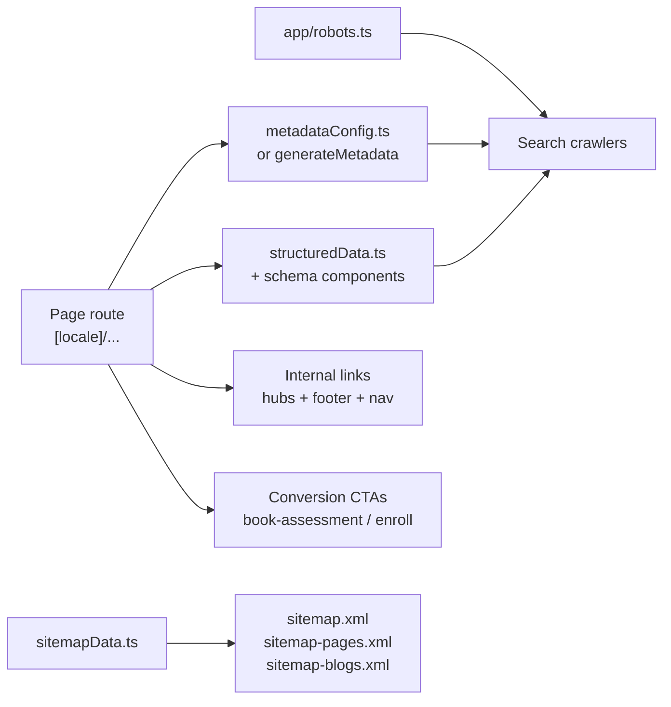

# GrowWise School — SEO Architecture Hub

This document maps how SEO works in `growwise_newui` and links to operational runbooks.

**Agent checklist (mandatory before route/content changes):** [`.cursor/SEO.md`](../.cursor/SEO.md)

---

## Architecture overview



**Primary business goal:** increase booked assessments (`/book-assessment`) and paid enrollments (`/enroll`).

---

## File reference

| Concern | Location |
|---------|----------|
| Page titles, descriptions, keywords | `src/lib/seo/metadataConfig.ts`, `src/lib/seo/metadata.ts` |
| Canonical site URL | `src/lib/seo/siteUrl.ts` → `getCanonicalSiteUrl()` |
| Sitemap entries + XML helpers | `src/lib/seo/sitemapData.ts` |
| Sitemap route handlers | `src/app/sitemap.ts`, `sitemap-pages.xml/`, `sitemap-blogs.xml/` |
| Crawl policy | `src/app/robots.ts` (no `public/robots.txt`) |
| JSON-LD helpers | `src/lib/seo/structuredData.ts` |
| Schema components | `src/components/schema/` |
| Camp SEO landing pages | `src/lib/camps/get-camp-page.ts`, `src/lib/seo/camp-metadata.ts` |
| Featured camp guide tiles | `src/components/camps/FeaturedCampGuidesSection.tsx` |
| Blog conversion bands | `src/components/blogs/BlogPostConversionSection.tsx` |
| Resource article registry | `src/data/resources/index.ts` → `RESOURCE_ARTICLE_PATHS` |
| Locale routing | `src/middleware.ts` (`localePrefix: 'never'`) |
| Locale-aware paths | `src/lib/publicPath.ts` → `publicPath()`, `absoluteSiteUrl()` |

---

## Sitemap structure

| Sitemap | Contents |
|---------|----------|
| `/sitemap.xml` | Index pointing to child sitemaps |
| `/sitemap-pages.xml` | Core pages, academic, courses, STEAM, camps, enroll, assessment |
| `/sitemap-blogs.xml` | `/growwise-blogs/*` posts + `/resources/*` articles |

**Adding a new indexable page:** edit `sitemapData.ts` (`corePages`, `blogPostPaths`, or rely on `RESOURCE_ARTICLE_PATHS` / `getCampSlugs()`).

---

## Hub-and-spoke content map

Cross-link these clusters; do not delete or redirect URLs without GSC validation.

| Hub | Spokes / related URLs |
|-----|----------------------|
| **Dublin local** | `/dublin-ca`, location mentions on academic/camp pages |
| **Summer camps** | `/camps/summer`, `/camps/{slug}` (6 camp guides), summer resource articles |
| **STEAM / coding** | `/steam`, `/steam/ml-ai-coding`, `/steam/game-development`, `/coding`, `/game-dev` |
| **Academic / math** | `/academic`, `/academic/math`, `/courses/math`, `/math-finals-practice-session` |
| **Assessment funnel** | `/book-assessment`, `/self-check`, `/enroll`, `/enroll-academic` |
| **Blog → program** | Legacy blogs link to intent-matched program + assessment (see `.cursor/SEO.md` mapping) |

---

## Content systems

### Resources (`/resources/*`)

- Registry: `RESOURCE_ARTICLE_PATHS` in `src/data/resources/index.ts`
- Modern structured pages with FAQ, related content, and hub links
- Auto-included in blogs sitemap when path is in registry

### Legacy blogs (`/growwise-blogs/*`)

- Individual `page.tsx` per slug under `src/app/[locale]/growwise-blogs/`
- Slugs listed manually in `sitemapData.ts` → `blogPostPaths`
- Bottom CTA standard: `BlogPostConversionSection` (program + assessment + enroll)

---

## Conversion path patterns

### Blog posts

```
Article content → relevant program hub → /book-assessment → /enroll (tertiary)
```

Component: `src/components/blogs/BlogPostConversionSection.tsx`

### Camp pages

```
/camps/summer hub → FeaturedCampGuidesSection → /camps/{slug} → request seat / assessment
```

Component: `src/components/camps/FeaturedCampGuidesSection.tsx`

### Programs hub

```
/programs → Book Free Assessment (primary) + Enroll Now + academic/STEAM cards
```

---

## Known gotchas

| Issue | Resolution |
|-------|------------|
| `/enroll` route shadowing | Marketing form at `[locale]/enroll`; Phase3 only when `?program=` is set. No root `app/enroll/page.tsx`. |
| Parallel STEAM URLs | `/coding` and `/game-dev` coexist with `/steam/*` — cross-link, don't consolidate without GSC data. |
| `/en/` legacy URLs | Middleware 301s to prefix-free canonical. Do not make `/en/*` return 200. |
| Robots conflict | Only `app/robots.ts`. Never reintroduce `public/robots.txt`. |
| FAQ JSON-LD | Visible FAQ text must match `FAQPage` schema exactly (AEO + Rich Results). |
| Email addresses | Frontend uses `contact@growwiseschool.org`; backend notification constants may differ — don't mix in user-facing copy without checking. |

---

## Automated tests

| Test file | What it guards |
|-----------|----------------|
| `src/lib/seo/__tests__/robots.seo.test.ts` | Merged robots disallow rules |
| `src/lib/seo/__tests__/sitemapData.test.ts` | Sitemap paths and XML output |
| `src/lib/seo/__tests__/metadata-length-limits.test.ts` | Title/description length |
| `src/lib/seo/__tests__/seo-jsonld-route-audit.test.ts` | JSON-LD on key routes |
| `src/lib/seo/__tests__/countJsonLdTypes.test.ts` | Duplicate schema types |
| `src/lib/seo/__tests__/homeFaqSchemaDuplicate.test.ts` | Single FAQPage on home |

```bash
cd growwise_newui
npm test -- --testPathPatterns=robots.seo|sitemapData|metadata-length|countJsonLd|homeFaq
npm run build
```

---

## Operational runbooks

| Document | When to use |
|----------|-------------|
| [seo-post-deploy-checklist.md](./seo-post-deploy-checklist.md) | After deploying SEO fixes — GSC sitemap, indexing requests, Rich Results |
| [seo-jsonld-validation.md](./seo-jsonld-validation.md) | FAQ/JSON-LD issues, "crawled not indexed", canonical troubleshooting |
| [seo-30day-dashboard.md](./seo-30day-dashboard.md) | 30-day monitoring cadence |
| [ahrefs-recrawl-tracking.md](./ahrefs-recrawl-tracking.md) | Third-party crawl tracking |

---

## URL change policy

**Default:** improvements only (CTAs, linking, metadata, schema). No URL deletions, 301 redirects, noindex, or content removals.

**Before any URL consolidation:** validate with Google Search Console and analytics. Document candidates in audit notes; execute only after explicit approval with data.

---

## Related enforced rules

- [`.cursor/rules.md`](../.cursor/rules.md) §7 — SEO & content integrity
- [`.cursor/rules/growwise-school-enforced.mdc`](../.cursor/rules/growwise-school-enforced.mdc) — always-on agent rules
- [`CLAUDE.md`](../../CLAUDE.md) — repo-level guidance
